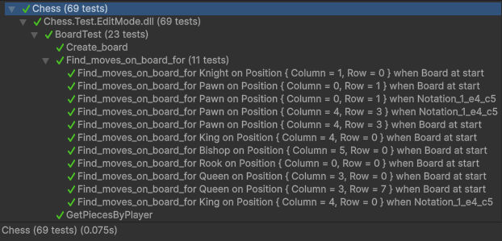
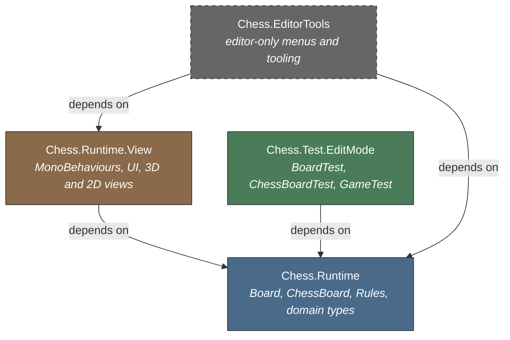
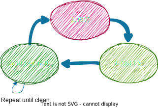
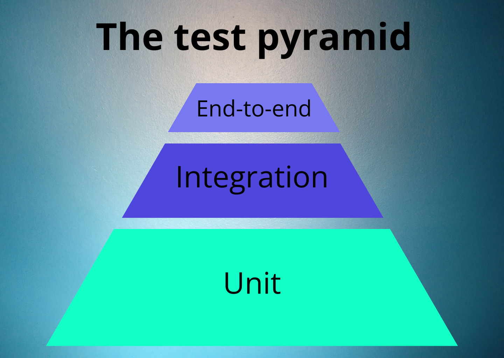
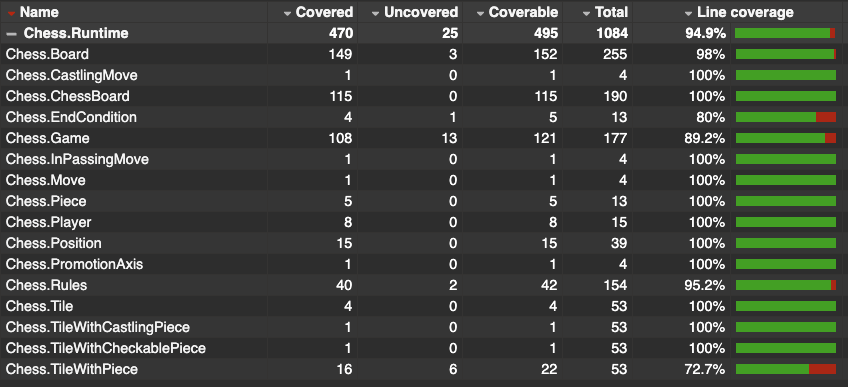
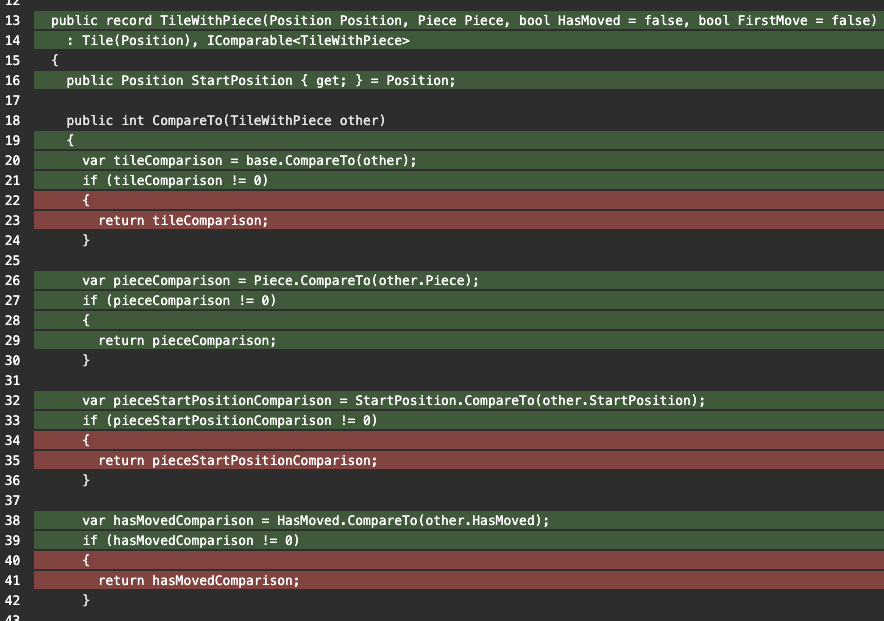
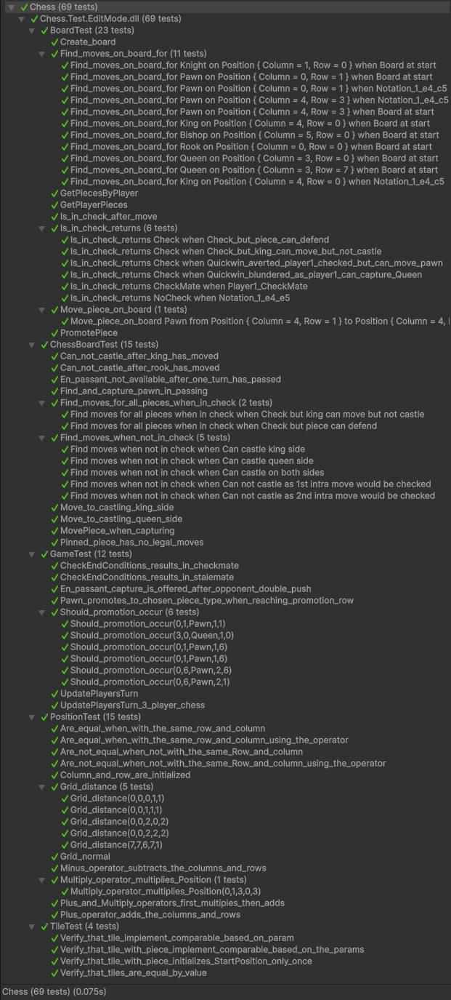
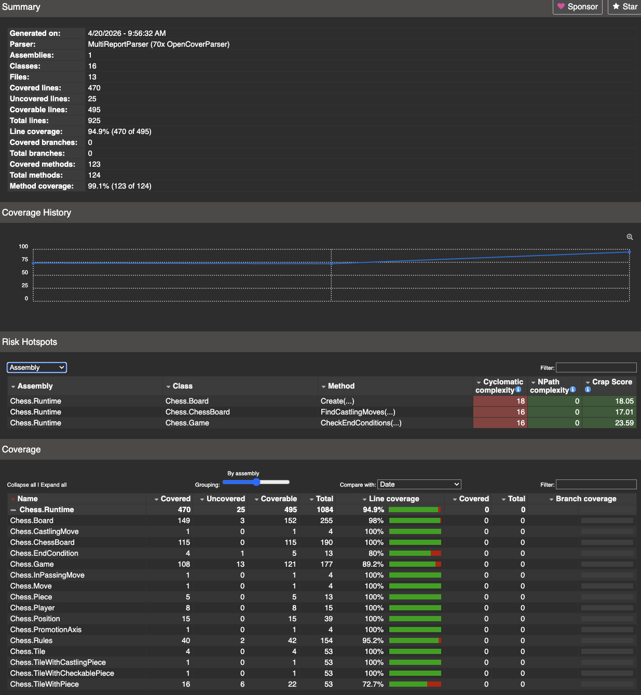

# Chess

[](https://github.com/EgillAntonsson/chess/actions/workflows/test.yml)

A chess engine built in C# 10 for Unity 6. The codebase demonstrates testability-first design, clean separation of concerns, and automated test infrastructure using the Unity Test Runner.



## 2D / 3D view toggle

<video src="https://github.com/user-attachments/assets/dc937969-c663-4cfe-8407-ecf761a1d5c7" controls width="800"></video>

A runtime button toggles between the 3D and 2D view: the camera swaps pose and every tile re-skins its piece GameObject via a different `PiecePrefabMapper`. Game state is untouched — a selected piece stays selected, the king-in-check highlight persists across the swap, the next move continues seamlessly.

The toggle component (`ViewModeController`) holds no reference to `Game`, `ChessBoard`, or `Player`. It cannot — the View assembly references the Domain, not the other way around, and the compiler enforces that. Adding a third view (isometric, VR, an entirely different rendering style) follows the same pattern: a new mapper, a new camera pose, zero domain changes.

The 2D pieces are placeholder colored letters (K/Q/R/B/N/P) generated procedurally by a small editor menu (`Tools > Chess > Generate 2D Piece Prefabs`) — twelve prefabs and the mapper asset authored by code in a single click instead of twelve trips through the inspector. The same script regenerates them, which keeps placeholder iteration cheap. Replacing the placeholders with real sprite assets is then a per-prefab inspector change, no code changes required.

## Architecture



Each box is a separate [Assembly Definition](https://docs.unity3d.com/Manual/ScriptCompilationAssemblyDefinitionFiles.html). `Chess.Runtime` has **zero** assembly references — it contains only pure C# domain logic with no dependency on the View. The View references the Domain but never the other way around, and the compiler enforces this: adding an upward reference is a build error, not a code-review comment. Convention-based layering gets eroded over time — compiler enforcement removes the temptation. `Chess.EditorTools` is an Editor-only assembly that ships nothing at runtime — it hosts menu items and asset-generation tooling (e.g. the procedural 2D piece prefab generator).

### Board / ChessBoard layering
Testability was the primary motivation for this separation. `Board` is a pure static class: every method takes its inputs and returns its outputs with no side effects, so it can be unit-tested directly — no Unity runtime required, no setup cost, and no state leaking between tests. `ChessBoard` owns the mutable game state (`Tile[,]`, player dictionaries) and delegates all logic to `Board`, keeping state mutations explicit and centralised. If the architecture makes testing natural, the tests get written and maintained; if testing requires workarounds or mocking frameworks, it won't happen consistently.

### Null-free domain model
The domain types are designed so that `null` does not arise in normal use. Value types (`readonly record struct`) cannot be null, record class hierarchies are constructed with required parameters, empty board positions are represented by a `Tile` (not `null`), and empty collections return an empty array instead of `null`. Instead of defensive `if (tile != null)` guards throughout game logic, the type system guarantees that every `Tile[,]` slot contains a valid `Tile` — an empty square is a domain concept, not an absence of data.

The alternative — `#nullable enable` — adds a compiler flow-analysis layer over the existing nullable types. Even configured to error rather than warn, it remains a flow-analysis layer rather than a type-level guarantee: nulls still exist at runtime, and the analysis requires `[NotNullWhen]` annotations and `!` suppressions wherever the compiler can't flow nullability through method calls. The null-free model eliminates null at the source.

### Functional over imperative
The domain logic favours functional programming over imperative code. `Board` methods are pure functions — inputs in, outputs out, no shared mutable state. Collections are transformed with LINQ rather than mutated with loops, and board state is cloned rather than modified in place (`Tile[,]` is cloned on every move, capture, or promotion). OOP is used where it fits — the `Rules` class hierarchy, the `Tile` record inheritance — but the default is functional composition. This produces code that is more testable, composable, and less error-prone.

### Clone-on-write immutability
The board clone on every mutation means methods return the new board array rather than modifying one in place. This eliminates shared-state bugs and makes it straightforward to reason about each game transition independently. The trade-off is garbage-collection pressure (due to new board array creations), which is acceptable given the small board size. Because the cloning is an implementation detail behind `Board`'s pure-function API, it could be replaced with a lower-allocation solution (e.g. pooled arrays) without changing any tests.

### Variant configurability via Rules
`Rules` is an open class with virtual properties and methods: `BoardAtStart`, `MoveDefinitionByType`, `PromotionPosition`, `EndConditions`, and others. A chess variant is a subclass that overrides only what differs — piece movement, board layout, promotion rules, or win conditions — without touching core logic. The engine is agnostic to standard vs. variant chess. Open/closed in practice: the core logic is closed for modification, open for extension through inheritance — adding a chess variant doesn't touch core logic.

### Value types for domain primitives
`Position`, `Piece`, `EndCondition`, and `PromotionAxis` are `readonly record struct`. They get structural equality, immutability, and stack allocation for free, removing boilerplate and making comparisons and collection lookups correct by default. Primary constructors and `with` expressions keep the syntax concise — creating a moved position is `position with { Row = 3 }` rather than a manual copy.

The Tile hierarchy (`Tile` -> `TileWithPiece` -> `TileWithCastlingPiece` -> `TileWithCheckablePiece`) uses `record` (reference type) instead, because it requires inheritance for type discrimination and some fields are reference types. Both forms are immutable — `record` properties are `init`-only, so instances are created once and never mutated.

### Named records for move concepts
`InPassingMove` and `CastlingMove` replace anonymous tuples in method signatures. Naming these concepts makes the signatures self-documenting and ties the code to the chess domain rather than to implementation structure.

### Refactoring discipline
The commit history is intentionally many small, single-concern commits rather than few large ones. Each refactor is behaviour-preserving with the test suite as the safety net, and each message names exactly one concern. Recent examples: `Replace Board.Create tuple with BoardSetup record` (a named domain concept replacing a positional output), `Reduce ChessBoard.Create return to Tile[,]` (narrowing a public surface to what callers actually use), `Add Reskin path that preserves tile highlights` (splitting one method that conflated two responsibilities into two methods with explicit semantics). This style keeps each diff readable in isolation, localises rationale to where it belongs, and makes `git bisect` trivial when something does break later.

## Testing

### Test-driven development



Development followed a TDD cycle: write a failing test, implement just enough to make it pass, then refactor. Exploratory play sessions supplemented the cycle — playing the game surfaced edge cases and missing rules that became the next failing test. Once a feature's tests were green and play sessions no longer revealed issues, the feature was considered complete. The high test coverage is a natural outcome of this workflow, not a target that was chased — the coverage report was generated at the end as confirmation, not as a goal.

### Three-layer test architecture



The test suite follows the testing pyramid, with each layer isolated to what it owns:

- **`BoardTest`** — pure unit tests against `Board`, a static class with no side effects. Board state is constructed from a [string fixture](#board-state-fixtures) and passed in directly; no state leaks between tests.
- **`ChessBoardTest`** — integration tests against `ChessBoard`, verifying that mutable state is managed correctly across move sequences: castling eligibility after the king or rook has moved, en passant expiry after one turn, pinned pieces with no legal moves.
- **`GameTest`** — end-to-end tests through `Game.MovePiece`, covering the full move pipeline: multi-turn promotion sequences, en passant offered and taken, checkmate and stalemate resolution.

Keeping the layers separate means board logic can be verified without game state, and game-level behaviour can be verified without reimplementing board rules in the test. All domain logic lives outside the Unity runtime, so every test runs in EditMode — no scene loading, no frame ticking, no MonoBehaviour lifecycle overhead. This design paves the way for tests that are easy and natural to write; if a test is hard to write, that's a design signal, not a testing problem.

### Unity Test Runner / NUnit
All tests run in EditMode via the Unity Test Runner and are executed automatically on every push via GitHub Actions CI. Parameterised cases use `[TestCaseSource]` with generated names, and individual test methods follow a behaviour-driven naming style (e.g. `Pinned_piece_has_no_legal_moves`), so the intent of any failing test is readable without opening the test body.

### Board state fixtures
`BoardTileString` is a lightweight DSL (domain-specific language) for board state: named static methods that return compact string representations of board positions. Each method name describes the scenario — `Can_castle_king_side()`, `Bishop_pinned_by_rook()`, `Stalemate_player_2_can_not_move()` — so the string is readable at a glance as an 8x8 grid, the method name doubles as documentation, and TestRunner output reads like a specification. Fixtures are shared across all three test layers, and adding a new scenario is adding a new method — no test code changes required.

```csharp
public static string Can_castle_king_side()
{
    return @"
R2 N2 B2 Q2 K2 B2 N2 R2
P2 P2 P2 -- -- -- P2 P2
-- -- -- -- -- P2 -- --
-- -- -- P2 P2 -- -- --
-- -- -- -- -- -- -- --
-- -- -- B1 P1 N1 -- --
P1 P1 P1 P1 -- P1 P1 P1
R1 N1 B1 Q1 K1 -- -- R1
";
}
```

### Code coverage report
The report was generated after the test run and lists the coverage ratio of the `Chess.Runtime` assembly. You can view it in your web browser by clicking [this link](CodeCoverage/Report/index.html).



In the web browser, you can click to drill down to a specific method and see the coverage ratio.



## Next steps

### Planned
- **Visual polish** — improve the promotion selection UI, and replace the placeholder 2D piece letters with proper sprite assets.
- **Migrate to Input System** — the project uses the legacy Input Manager, which Unity 6 has marked for deprecation. Migrating to the new Input System package would future-proof the input handling.

### Considered
- **AI opponent** — implement a computer player, starting with a basic evaluation function (material count, piece position) and minimax search, then iterating toward alpha-beta pruning and more sophisticated heuristics. This could mean increasing evaluations to thousands per frame and would include benchmarking performance and evaluating whether to move from the current clone-on-write board design to a lower-allocation solution (e.g. renting arrays from `ArrayPool<Tile>.Shared` or `Span<T>` over a `stackalloc` buffer). Because the board cloning is an implementation detail behind `Board`'s pure-function API, changing it would not require any test changes.
- **Gradual piece movement** — pieces currently teleport to their destination tile; smooth transitions (especially for the Knight's L-shape and castling's two-piece move) would improve game feel.

## Detailed images

Full test suite and coverage report detail:




